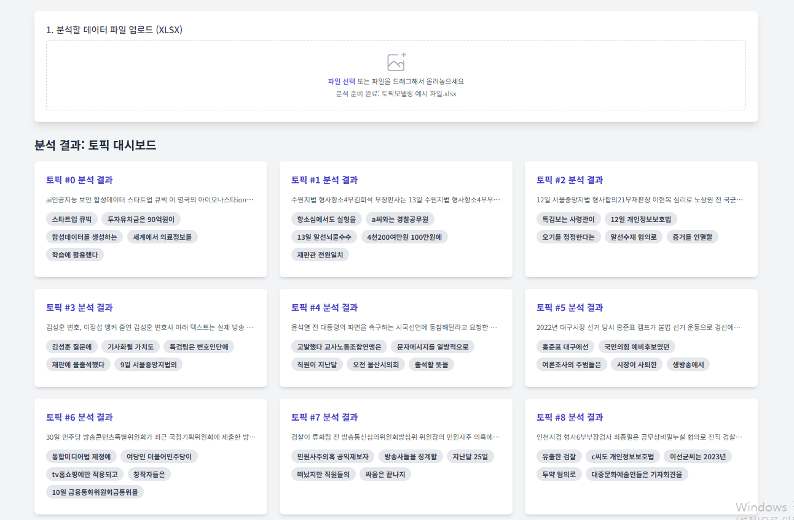
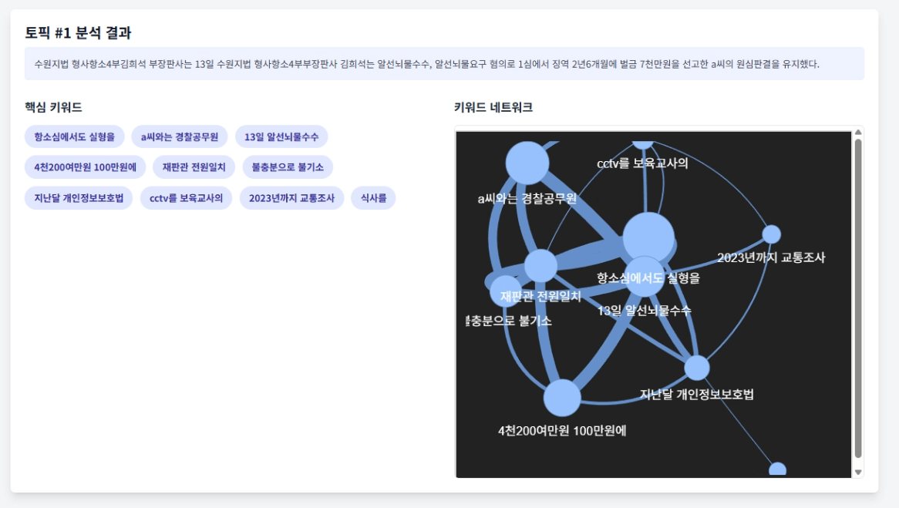

# 🏛️ CLUSTER: 뉴스·소셜 토픽 추출 및 입법예고 연계를 통한 입법수요지수 산출 모델

**CLUSTER**는 방대한 규모의 비정형 뉴스 및 소셜 데이터를 분석하여 실시간 사회적 담론을 추출하고, 이를 실제 국회 입법예고 데이터와 연계하여 **'입법수요지수(LDI)'**를 정량적으로 산출·제공하는 의사결정 지원 플랫폼 프로젝트입니다.

> 본 프로젝트는 사회적 여론이 실제 제도로 전이되는 과정을 계량화하여, 정책 담당자가 조기에 입법 수요를 파악하고 우선순위를 합리적으로 설정할 수 있도록 돕기 위해 수행되었습니다.

---

## 🎯 프로젝트 목적 및 목표

* **여론과 제도의 간극 해소:** 뉴스·SNS에서 생성되는 대규모 비정형 텍스트를 의미 기반 토픽(Semantic Embedding)으로 정규화하여 실시간 사회적 수요를 파악합니다.
* **실증적 연계 분석:** 추출된 토픽과 실제 '입법예고' 데이터를 의미적 유사도 및 시간 축(Temporal Window)을 기준으로 매칭하여 여론의 법제화 과정을 추적합니다.
* **입법수요지수(LDI) 개발:** 토픽의 화제성, 집중도, 응집성, 확산성 등의 정량적 속성을 통합하여 단일화된 '입법수요지수(Legislative Demand Index)'를 산출합니다.
* **실행형 서비스 구현:** 도출된 결과를 웹 기반 대시보드로 시각화하여, 정책 담당자가 별도의 분석 도구 없이도 직관적으로 탐색하고 조기 경보로 활용할 수 있도록 지원합니다.

---

## 📚 데이터 및 분석 방법론

* **활용 데이터**
    * **뉴스·소셜 데이터:** 약 26만 건 (빅카인즈, X, 네이버 블로그, 인스타그램, 유튜브 등).
    * **입법예고 데이터:** 국회 입법예고 시스템 (개인정보보호법, 정보통신망법, 자본시장법, 아동복지법 등 4개 주요 법률군 대상).
* **데이터 전처리**
    * 특수문자/이모티콘 정규화 및 광고/홍보성 텍스트 필터링.
    * MinHash LSH를 활용한 자카드 유사도(0.9 이상) 기반 근사 중복 문서 제거.
    * KoNLPy를 활용한 형태소 추출 및 채널별 불용어 처리.
* **토픽 모델링 및 매칭 (AI 파이프라인)**
    * **임베딩 및 군집화:** KR-SBERT로 문장 임베딩 후, UMAP(차원축소)과 HDBSCAN, c-TF-IDF를 결합한 **BERTopic**을 통해 토픽을 추출했습니다.
    * **의미·시간 연계:** 토픽과 입법예고 본문 간의 코사인 유사도(임계값 0.6)와 180일의 시계열 창을 적용하여 입법 전이 여부를 라벨링했습니다.
* **입법수요지수(LDI) 설계**
    * 토픽의 5가지 핵심 축(화제성, 중심성, 응집성, 확산성, 반짝성 페널티)을 바탕으로 아래와 같은 산식을 도출했습니다.

$$LDI = 0.30 \times Buzz + 0.25 \times Focus + 0.25 \times Depth + 0.20 \times Spread - 0.15 \times Penalty$$

---

## 📊 주요 분석 결과

* **입법 전이에 영향을 미치는 핵심 신호**
    * 단순한 언급량보다는 **감성적 프레이밍(긍·부정 비율 및 강도)**이 입법 전이에 가장 강력한 영향을 미쳤습니다.
    * 어휘의 다양성, 높은 정보 밀도(문장/토큰 길이), 핵심어의 응집력이 담론의 제도화에 유리하게 작용함을 확인했습니다.
    * 무차별적인 확산이 아닌, **'의미 있는 출처 다양성(출처의 균형 있는 참여)'**이 확보될 때 입법수요지수가 높게 나타났습니다.
* **법률 도메인별 민감도 차이**
    * **자본시장법 / 아동복지법:** 텍스트의 감성 강도, 길이, 핵심어 반복 등 텍스트 내재적 지표에 **민감**하게 반응하여 비교적 예측이 용이했습니다.
    * **개인정보보호법 / 정보통신망법:** 텍스트 지표만으로는 반응이 다소 약해, 소셜 확산 및 출처 다양성 등 거시적 지표의 보정이 필요한 **둔감군**으로 확인되었습니다.

---

## 💡 기대 효과 및 활용 전략

구현된 웹 대시보드와 산출된 LDI 지수는 다음과 같이 실무적 의사결정을 지원합니다.

* **객관적 우선순위 설정:** 단순 빈도 중심의 기존 정성적 파악 한계를 넘어, 확산의 질·핵심어 집중·정보 밀도를 종합한 정량적 근거(LDI)를 통해 입법 심사 우선순위를 합리적으로 결정할 수 있습니다.
* **사전 조기경보 체계:** 급상승 토픽의 확산 추세를 조기에 탐지하여 이슈 브리핑 및 정책 커뮤니케이션을 선제적으로 수행할 수 있습니다.
* **영역별 맞춤형 대응:** 법률 분야별 특성을 반영하여 자본·개인정보 분야는 '확산 질과 구조화 신호'를, 아동복지 분야는 '감성 강도의 누적'을 경보 조건으로 우선 적용하는 등 차등화된 모니터링이 가능합니다.
* **상시 활용성:** 대시보드 형태로 결과가 상시 제공되므로 상임위원회, 소위원회, 전문가 회의 등 다양한 정책 현장에서 즉시 활용할 수 있습니다.

---

## ⚠️ 운영 제약 및 한계점

시스템 운영 및 분석 결과 해석 시 다음의 제약 사항을 고려해야 합니다.

* **시스템 운영 제약**
    * 생성 요약(KoBART), 임베딩(SBERT), 키워드 네트워크(PyVis) 모듈은 연산 요구량이 커 GPU 가속 환경(8–16GB VRAM)을 권장합니다. CPU 환경 운영 시 생성 요약 비활성화 및 경량화 모델 적용 등의 보수적 설정이 필요합니다.
    * 라이브러리(PyTorch, BERTopic, pandas 등) 버전 충돌 이슈를 방지하기 위해 엄격한 의존성 관리와 환경 스냅샷 공유가 필수적입니다.
    * 서버 부하 방지를 위해 원시 데이터 전체를 웹에서 일괄 처리하기보다 사전 산출된 토픽 단위 결과를 웹에 업로드하여 렌더링하는 경량 서비스 형태로 시스템을 현실화했습니다.
* **분석의 한계점**
    * 180일의 시계열 창과 0.6의 의미 유사도 임계값 기준은 지연된 입법 경로를 일부 놓치거나 우연한 의미 유사성을 과대 포착할 가능성이 존재합니다.
    * 분석 범위가 4개 법률군으로 한정되어 있으며, 대형 사건이나 정책 발표 등 외생 변수가 입법에 미치는 영향을 완전히 통제하지 못해 일반화에 제약이 따릅니다.
    * 플랫폼 편향성, 전처리 과정의 데이터 손실, 감성 사전의 도메인 불일치 등 측정 오차가 잔존할 수 있습니다.
    * 본 연구 결과는 인과관계 단정이 아닌 관측된 상관관계와 예측 가능성의 실증으로 해석되어야 합니다.

---

## 🚩 결론 및 향후 계획

* 본 프로젝트는 의미 임베딩과 시간 제약에 근거한 파이프라인을 구축하여, **사회적 수요의 계량화 → 입법 전이 조기 포착 → 정책 우선순위 근거 제시**의 일관된 프레임워크를 실증적으로 제시했습니다.
* 향후 외생 이벤트를 공변량으로 포함하는 민감도 분석을 정례화하고, 시계열 보존형 분할 및 임계값 튜닝을 통해 모델을 고도화할 계획입니다.
* 축적형 데이터와 엄격한 편향 점검(데이터 거버넌스)을 전제로 확장한다면, 다양한 정책 영역에서 대국민 소통의 질을 향상시키는 실질적인 의사결정 지원 도구로 기능할 것입니다.

---

## 🧑‍💻 팀 소개 및 자료

* **팀명:** CLUSTER
* **소속:** 인천대학교 산업경영공학과 데이터 분석 동아리 SeD (Shall we Data?) 2기 운영진
* **참여 멤버:** 조윤빈, 최성현
* **📎 첨부 자료:** [`경진대회 제출 보고서.docx`](./경진대회 제출 보고서.docx), [`Clustr.pdf`](./Clustr.pdf)

### 📂 핵심 대시보드 및 시각화 결과
* **
* **
